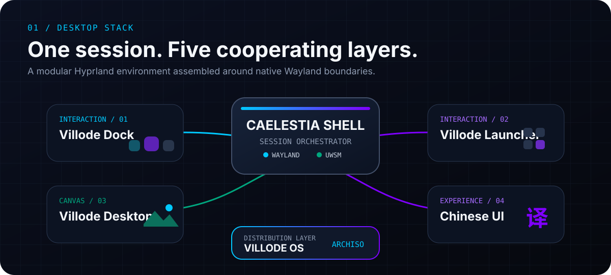
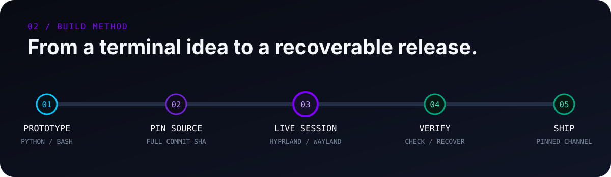
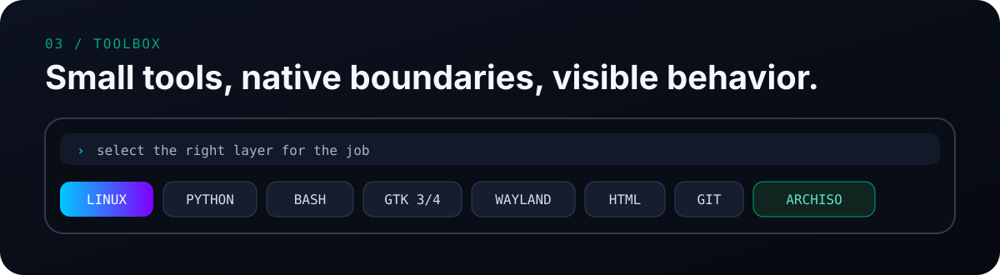
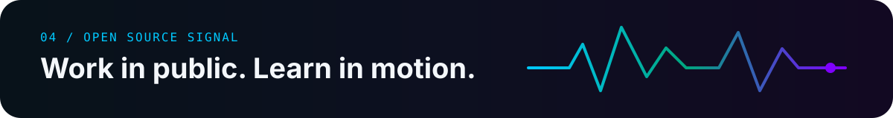

<div align="center">

[](https://git.io/typing-svg)

<p><em>Building a polished, accessible desktop experience for Hyprland.</em></p>

[](https://villode.com)


<br /><br />

  <picture>
    <source media="(prefers-color-scheme: dark)" srcset="https://raw.githubusercontent.com/Villode/Villode/output/github-contribution-grid-snake-dark.svg" />
    <source media="(prefers-color-scheme: light)" srcset="https://raw.githubusercontent.com/Villode/Villode/output/github-contribution-grid-snake.svg" />
    
  </picture>
</div>

<br />

<p align="center">
  
</p>

Tools that make **Hyprland** feel like a complete desktop — modular enough to use independently, coordinated enough to install as one tested session.

- **[Villode Caelestia](https://github.com/u0n0u/villode-caelestia)** — pinned Shell, Chinese UI and a unified component installer.
- **[Villode Dock](https://github.com/u0n0u/villode-dock)** — a GTK3 Dock with compositor-native blur, drag ordering and Launcher integration.
- **[Villode Launcher](https://github.com/u0n0u/villode-launcher)** — a GTK4 application grid with search, categories and keyboard-first control.
- **[Villode Desktop](https://github.com/u0n0u/villode-desktop)** — a background layer for static images, video and local or remote HTML.
- **[Villode OS](https://github.com/Villode/villode-os)** — an ArchISO-based path from the component stack to a bootable desktop image.

<p align="center">
  
</p>

Everything starts in the terminal. I prototype in Python and Bash, pin complete component commits, test them together in a live Hyprland session, and only then move them into the release channel.

```text
terminal → prototype → pin → live test → verify → ship
```

**Design principles**

- Native Wayland first — no X11 fallback hidden behind the interface.
- Keyboard-accessible — core actions stay reachable through predictable `Super` shortcuts.
- Recoverable changes — existing sessions remain available unless replacement is explicitly requested.
- Glass blur where it communicates depth or state, not on every surface.
- One installer that remains understandable from either TTY or desktop.

<p align="center">
  
</p>

<div align="center">
  
</div>

<br />

<p align="center">
  
</p>

<div align="center">
  
</div>

<br />

<div align="center">
  
  
  <br />
  
  
</div>

<br />

<div align="center">

*Built with ❤️ for the Hyprland community.*

</div>
