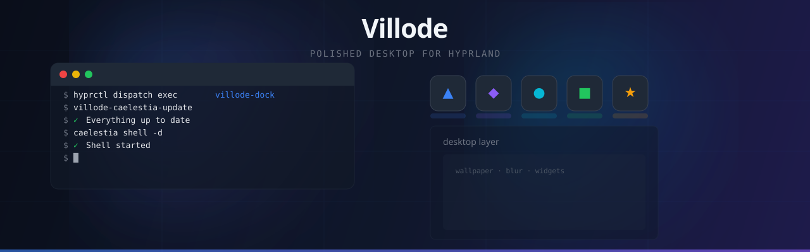

<div align="center">



</div>

---

## What I Build

I create tools that make **Hyprland** feel like a complete desktop — not just a tiling window manager, but a polished, accessible environment with familiar interactions.

Each project solves a real gap in the Hyprland ecosystem:

| Project | What it does | Built with |
| --- | --- | --- |
| [**villode-caelestia**](https://github.com/Villode/villode-caelestia) | One-click installer for Caelestia Shell + optional Dock, Desktop, Launcher, and Chinese UI | Bash · Shell · Python |
| [**villode-dock**](https://github.com/Villode/villode-dock) | macOS-style dock with real-time blur, drag-to-reorder, and glass menus | Python · GTK3 · GtkLayerShell |
| [**villode-launcher**](https://github.com/Villode/villode-launcher) | Launchpad-style app grid with keyboard-first search | Python · GTK4 · Adwaita |
| [**villode-desktop**](https://github.com/Villode/villode-desktop) | Dynamic wallpaper layer supporting images, video, and HTML5 | Python · HTML5 · Canvas |

---

## How I Work

```
terminal → code → build → test → ship
```

Everything starts in the terminal. I prototype in Python/Bash, test on live Hyprland, and ship through a pinned release channel so users get stable versions without breaking their setup.

**Design philosophy:**
- Native Wayland first (GtkLayerShell, no X11 fallbacks)
- Keyboard-accessible (Super+Return, Super+D, Super+E)
- Glass blur where it makes sense, not everywhere
- One installer that works from TTY or desktop

---

## Tech Stack

<div align="center">
  
</div>

---

## Activity

<picture>
  <source media="(prefers-color-scheme: dark)" srcset="https://raw.githubusercontent.com/Villode/Villode/output/github-contribution-grid-snake-dark.svg" />
  <source media="(prefers-color-scheme: light)" srcset="https://raw.githubusercontent.com/Villode/Villode/output/github-contribution-grid-snake.svg" />
  
</picture>

<div align="center">
  
</div>

---

## Stats

<div align="center">
  
  
  <br />
  
  
</div>
